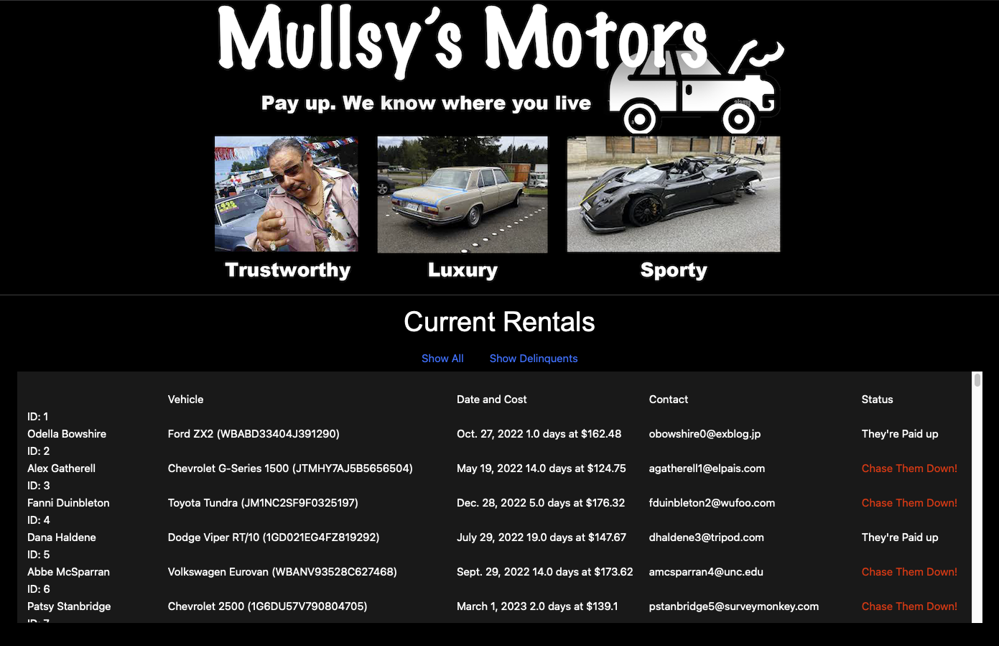

# Takehome Task for FFI
by Graeme Muller

* Utilises Python + Django for backend
* Django Forms, HTML, CSS for frontend

### Running Mullsy's Motors
1. Download the project as Zip ([Mullsy's Motors](https://github.com/dodgydesigns/ffi_takehome/archive/refs/heads/main.zip))
2. cd into the project folder "ffi_takehome-main"
3. If your environment doesn't have Django etc., run "pip3 install -r requirements.txt"
3. cd into the app folder "ffi"
4. Run the Django debug server, "python3 manage.py runserver"
5. Use your browser to navigate to "127.0.0.1:8000"
6. Have heaps of great fun!

### Improvements
* Employ Redux to store data in the browser - speed/efficiency
* Employ VUE.js as frontend framework - smoother feel
* Only update the table data rather than reloading the whole page